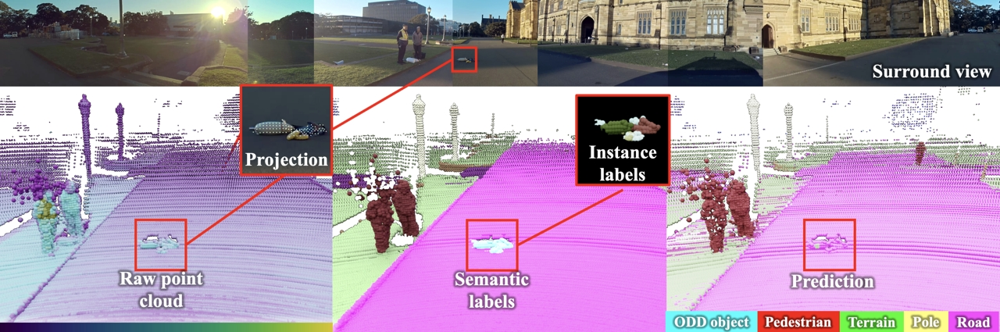

# Spotting the Unexpected (STU): A 3D LiDAR Dataset for Anomaly Segmentation in Autonomous Driving
<div align="center">
<a href="https://scholar.google.com/citations?user=xJW2v3cAAAAJ&hl=en">Alexey Nekrasov</a><sup>1</sup>, <a href="">Malcolm Burdorf</a><sup>1</sup>, <a href="https://scholar.google.com/citations?user=LNqaebYAAAAJ&hl=en">Stewart Worrall</a><sup>2</sup>, <a href="https://www.vision.rwth-aachen.de/person/1/">Bastian Leibe</a><sup>1</sup>, <a href="https://scholar.google.com/citations?user=wT0QEpQAAAAJ&hl=en">Julie Stephany Berrio Perez</a><sup>2</sup>

<sup>1</sup>RWTH Aachen University <sup>2</sup>The University of Sydney

3D Anomaly Segmentation Dataset




</div>
<br><br>

[[Project Webpage](https://vision.rwth-aachen.de/stu-dataset)]
[[Paper](https://arxiv.org/abs/2505.02148)]

---

## 🗞️ News
* **2025-06-14**: Images Released
* **2025-05-29**: Training Code and Checkpoints Released
* **2025-03-25**: Data and Evaluation Code Released
* **2025-02-26**: STU Accepted at CVPR 2025

---

## 💽 Data
- __STU__ dataset is available at [STU](https://omnomnom.vision.rwth-aachen.de/data/stu-dataset/).
- __PANOPTIC-CUDAL__ dataset is available at [Panoptic-CUDAL](https://omnomnom.vision.rwth-aachen.de/data/panoptic-cudal/).

To verify that downloaded files are correct, you can verify the SHA256 hash of the files.
```bash
sha256sum -c file_sha256sum.chk
```

Overall the data follows the SemanticKITTI format.
```tree
|── 125/
|   ├── poses.txt
|   ├── calib.txt
|   ├── labels/
|   │     ├ 000000.label
|   │     └ 000001.label
|   .
|   |
|   └── velodyne/
|         ├ 000000.bin
|         └ 000001.bin
.
.
└── 134/
```

Predictions are simple `.txt` files with confidence per point.

## 🏁 Evaluation
Simple evaluation for point-level anomaly segmentation:
```bash
python compute_point_level_ood.py --data-dir stu_dataset/val --pred-dir ./prediction
```

Simple evaluation for point-level anomaly segmentation:
```bash
python compute_object_level_ood.py --data-dir stu_dataset/val --instance-dir ./instance_prediction
```

## 🏎️ Training and Inference
Please check [Mask4Former3D folder in the repository](./Mask4Former3D/)

## 📒 TODO
- [ ] Open Public Test Submission
- [x] Release anonymized images
- [x] Release training code and checkpoints
- [x] Release code for points projection to images
- [x] Release the data
- [x] Release evaluation code

As of June 14, 2025, the public test submission is delayed due to the size of the test set and the computing requirements for evaluation.
I had initially planned to host the test set on Codalab/Codabench; however, a single submission for point-level evaluation would require a 3 GB upload, which is too large and takes too long to evaluate.
I will try to find a workaround for this limitation.
In the meantime, please feel free to evaluate on validation set, and if you have a method you would like to evaluate on test, email me and we can figure it out.

## 🙏 Acknowledgement
Many thanks to reviewers of our paper submission.
You helped us improve the project a lot.

## BibTeX
```
@inproceedings{nekrasov2025stu,
  title = {{Spotting the Unexpected (STU): A 3D LiDAR Dataset for Anomaly Segmentation in Autonomous Driving}},
  author = {Nekrasov, Alexey and Burdorf, Malcolm and Worrall, Stewart and Leibe, Bastian and Julie Stephany Berrio Perez},
  booktitle = {{"Conference on Computer Vision and Pattern Recognition (CVPR)"}},
  year = {2025}
}
```
